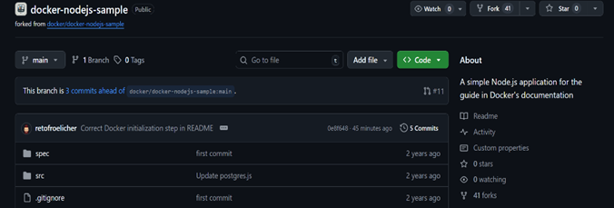
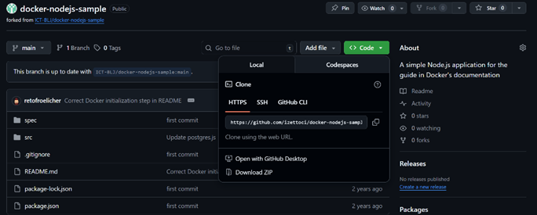
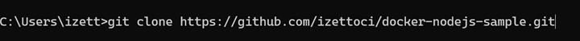
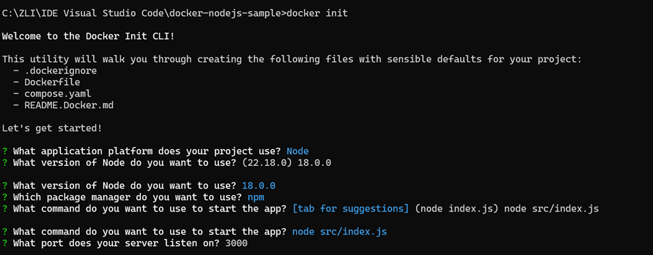
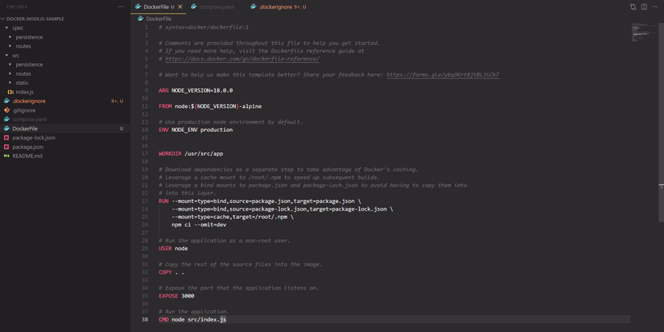
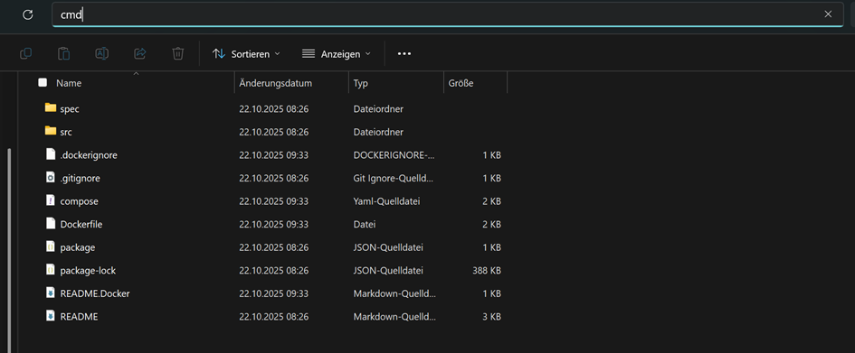
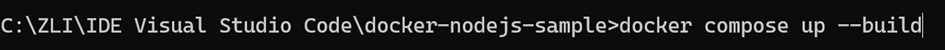
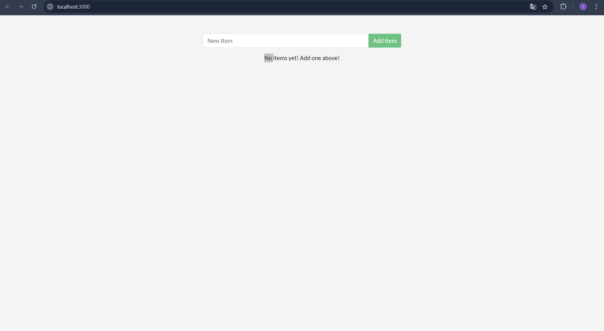

# **Thema:** Erstellen einer ToDo-Applikation mit Markdown, Git, GitHub und Docker

### **Schritte:**

1. **Klonen des Repositories:**
Zuerst habe ich den Link zum Repository geöffnet und auf Fork gedrückt. Danach habe ich es Lokal auf meinem Laptop geklont, dass habe ich gemacht, indem ich auf Code gedrückt habe und den URL kopiert habe, dann habe ich den Terminal geöffnet und "`git clone https://github.com/izettoci/docker-nodejs-sample.git`" eingegeben habe.

2. **Installation der notwendigen Pakete**
Ich habe die verschiedenen Links die auf Moodle gegeben waren geöffnet und die verschiedenen Pakete installiert.

3. **Docker-Konfiguration und -Installation**
Zuerst habe ich den Link docs.docker.com geöffnet und die Anleitung gefolgt. Beim ersten Schritt musste ich den Kommand "`docker init`" eingeben und dann die Fragen beantworten. Nachdem ich die Fragen beantwortet habe, wurden verschiedene Dateien hinzugefügt.

4. **Starten der Applikation in einem Docker-Container**
Ich habe im Terminal den Kommand "`docker compose up --build`" eingegeben. Danach öffnete ich den Link [http://localhost:3000/](http://localhost:3000/) um Zugriff auf die Applikation zu bekommen.

